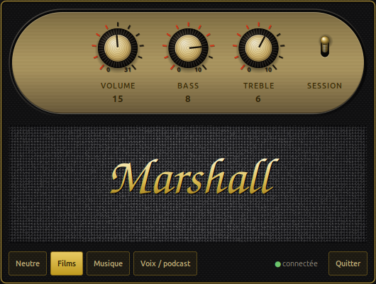

# marshall-acton3-linux

[](LICENSE)
[](https://www.python.org/)
[]()
[]()

Control your **Marshall Acton III** speaker from Linux — volume, bass and treble
— without reaching for the physical knobs and without the Marshall mobile app
(which has no Linux version).

<p align="center">
  
</p>
<p align="center">
  
</p>

<details>
<summary><b>English — quick start</b></summary>

A GNOME tray applet plus a CLI, talking to the speaker's proprietary BLE control
service through BlueZ over D-Bus. No PyPI dependencies, no virtualenv.

```bash
sudo apt install python3-gi gir1.2-gtk-3.0 bluez gnome-shell-extension-appindicator
git clone https://github.com/harryless17/marshall-acton3-linux
cd marshall-acton3-linux && ./install.sh
```

The speaker exposes **two Bluetooth identities**: the audio one (A2DP, leave it
alone) and a separate BLE one for control. You must pair the BLE identity once,
**with an authentication agent** — otherwise BlueZ refuses:

```bash
bluetoothctl --timeout 12 scan le | grep -i acton     # find "ACTON III [LE]"

{ echo "agent on"; sleep 1; echo "default-agent"; sleep 1; \
  echo "scan on"; sleep 8; echo "pair XX:XX:XX:XX:XX:XX"; sleep 25; \
  echo "quit"; } | bluetoothctl
```

Then:

```bash
marshall-ctl                   # show current state
marshall-ctl bass 6 treble 8   # 0..10 each
marshall-ctl volume 20         # 0..31
marshall-ctl preset Musique    # Neutre | Films | Musique | Voix / podcast
```

**Left-click** the tray icon to open a Cairo-drawn Marshall amplifier facade:
three two-tone knobs on a recessed brass capsule, each ringed by **red graduation
marks** that fill up with the value, plus a **gold toggle lever** for start-with-
session; below that the woven grille, the four presets, link status and a Quit
button. Knobs turn by vertical drag, by the mouse wheel (exactly one notch per
notch) or with the arrow keys, and they follow the speaker's physical knobs live.

The right-click menu still exists but **do not rely on it** — on GNOME 46 it does
not open at all, which is why everything lives in the window.

**Requires X11** — the applet uses `Gtk.StatusIcon`, which has no Wayland
equivalent. The CLI works anywhere. The tray extension must be enabled, or the
applet runs but stays invisible.

Protocol notes, firmware quirks and the reasoning behind the code are in
[`docs/`](docs/superpowers/specs/2026-07-30-marshall-applet-design.md). Comments
and documentation below are in French.

</details>

---

Régler le **volume, le bass et le treble** d'une enceinte **Marshall Acton III**
depuis Linux, sans toucher aux molettes physiques et sans passer par
l'application mobile Marshall (qui n'existe pas sous Linux).

- une **fenêtre en façade d'amplificateur**, dessinée en Cairo : trois molettes
  bicolores sur une plaque de laiton encastrée, chacune entourée de **graduations
  rouges** qui montent avec la valeur, plus un **levier doré** pour le démarrage
  avec la session. En dessous, la toile tissée, les quatre presets, l'état du lien
  et le bouton Quitter. **Clic gauche sur l'icône de la barre système** pour
  l'ouvrir ;
- un **CLI**, `marshall-ctl` ;
- les changements faits sur les molettes physiques de l'enceinte remontent en
  direct dans l'interface.

Les molettes se tournent au **glissé vertical**, à la **molette de la souris**
(exactement un cran par cran) ou aux **flèches du clavier**. Toute la course du
volume tient en 200 px de geste, celle du bass et du treble en 140.

> Le menu du clic droit sur l'icône existe encore, mais **ne comptez pas
> dessus** : sur GNOME 46 il ne s'ouvre pas du tout. C'est pourquoi tout est
> accessible depuis la fenêtre.

Projet personnel, non affilié à Marshall ni à Zound Industries. Le protocole a
été obtenu par reverse engineering, en partant de
[`anpct/marshall-acton3-ble`](https://github.com/anpct/marshall-acton3-ble).

## Prérequis réels

Testé sur **Ubuntu 24.04, GNOME sur X11**.

| Dépendance | Paquet Debian/Ubuntu | Pourquoi |
|---|---|---|
| Python ≥ 3.9 | `python3` | |
| PyGObject | `python3-gi` | tout passe par Gio/GLib |
| Typelib GTK 3 | `gir1.2-gtk-3.0` | **ne vient pas** avec `python3-gi` |
| BlueZ | `bluez` | `org.bluez` sur le bus système, et `bluetoothctl` pour l'appairage initial |
| Un hôte d'icônes de notification | `gnome-shell-extension-appindicator` | **sinon l'applet tourne mais reste invisible** |

```bash
sudo apt install python3-gi gir1.2-gtk-3.0 bluez gnome-shell-extension-appindicator
```

Aucune dépendance PyPI, aucun environnement virtuel.

Deux limites d'environnement à connaître :

- **X11 seulement.** L'applet utilise `Gtk.StatusIcon`, qui n'a pas d'équivalent
  sous Wayland. Le CLI, lui, fonctionne partout.
- L'extension d'icônes doit être **active** (`gnome-extensions list --enabled`).
  Sans elle, l'applet démarre, se connecte, et n'affiche rien.

## Installation

```bash
git clone <ce-depot> ~/Bureau/marshall-applet
cd ~/Bureau/marshall-applet
./install.sh
```

`install.sh` pose des **liens symboliques** vers le dépôt, donc modifier le
source suffit — pas besoin de réinstaller. En contrepartie :

> ⚠️ **Si tu déplaces ou renommes le dossier du dépôt, rejoue `./install.sh`.**
> Sinon les liens pointent dans le vide et l'applet ne démarre plus, sans aucun
> message — tu constaterais juste que l'icône a disparu.

Il installe :

| Chemin | Rôle |
|---|---|
| `~/bin/marshall-applet`, `~/bin/marshall-ctl` | liens vers le dépôt |
| `~/.local/share/marshall/marshall_ble.py` | lien vers le module |
| `~/.local/share/applications/marshall-applet.desktop` | entrée du lanceur |
| `~/.config/autostart/marshall-applet.desktop` | démarrage à l'ouverture de session |
| `~/.local/share/icons/hicolor/*/apps/marshall-applet.png` | l'icône **M**, en six tailles |

L'icône est le seul élément **copié** plutôt que lié : elle est rendue à
l'installation par le même code qui la dessine dans la barre système, donc
rejouer `./install.sh` la régénère.

`~/bin` n'est pas forcément dans ton `PATH`. Pour taper `marshall-ctl` sans le
chemin complet :

```bash
echo 'export PATH="$HOME/bin:$PATH"' >> ~/.zshrc && exec zsh
```

## Appairage de l'identité BLE — à faire une fois

L'enceinte expose **deux identités Bluetooth distinctes** :

- `ACTON III` — l'audio (A2DP). Probablement déjà appairée. **Ne jamais y
  toucher** : la retirer casserait le son.
- `ACTON III [LE]` — le canal de contrôle. C'est celle-ci qu'il faut appairer,
  séparément, et **avec un agent d'authentification** — sinon BlueZ refuse.

```bash
# 1. repérer l'adresse BLE (elle s'affiche comme "ACTON III [LE]")
bluetoothctl --timeout 12 scan le | grep -i acton

# 2. appairer, en gardant un scan actif pour que l'adresse reste valide
#    (l'adresse BLE est privée et tournante)
{ echo "agent on"; sleep 1; echo "default-agent"; sleep 1; \
  echo "scan on"; sleep 8; echo "pair XX:XX:XX:XX:XX:XX"; sleep 25; \
  echo "quit"; } | bluetoothctl
# attendre "Pairing successful"

# 3. vérifier
~/bin/marshall-ctl
```

Aucune manipulation physique de l'enceinte n'est nécessaire.

Cette procédure est aussi disponible hors ligne via `marshall-ctl --setup`.

## Usage

```bash
marshall-ctl                   # état courant
marshall-ctl bass 6            # 0..10
marshall-ctl treble 8          # 0..10
marshall-ctl volume 20         # 0..31
marshall-ctl bass 6 treble 8   # plusieurs réglages d'un coup
marshall-ctl preset Musique    # applique un preset
marshall-ctl presets           # liste les presets
```

Presets (bass / treble — ils ne touchent **jamais** au volume) :

| Preset | bass | treble |
|---|---|---|
| Neutre | 5 | 5 |
| Films | 8 | 6 |
| Musique | 10 | 7 |
| Voix / podcast | 3 | 8 |

Trouver l'applet : **Super**, puis `marshall` — ou `acton`, `enceinte`, `bass`,
`treble`, `égaliseur`…

## Tests

```bash
python3 -m unittest discover -s tests -t . -v
```

Les tests d'intégration (`tests/test_speaker.py`) demandent l'enceinte allumée et
appairée ; ils sont **sautés automatiquement** sinon. Les tests purs et ceux de
l'applet tournent sans matériel.

> ⚠️ **Arrête l'applet avant de lancer les tests d'intégration.** Le canal BLE
> n'accepte qu'un seul client : l'applet le monopolise et les tests échoueraient.
> ```bash
> pkill -f "bin/marshall-appl[e]t"     # les crochets évitent que pkill se tue lui-même
> python3 -m unittest discover -s tests -t .
> nohup ~/bin/marshall-applet >/dev/null 2>&1 &
> ```

`tests/manual_notify_probe.py` est une sonde manuelle : elle vérifie que
l'enceinte signale bien les changements faits sur ses molettes physiques.

## Diagnostic

L'applet journalise dans **`~/.local/state/marshall/applet.log`** (rotatif). Lancé
par l'autostart, il n'a aucune sortie visible : c'est le premier endroit à
regarder si l'icône n'apparaît pas ou si l'interface semble figée.

| Symptôme | Piste |
|---|---|
| Aucune icône, mais le process tourne | Extension d'icônes désactivée, ou session Wayland |
| Icône barrée en permanence | Enceinte éteinte, hors de portée, ou identité BLE non appairée |
| « Enceinte introuvable » au CLI | Idem, ou l'applet monopolise le canal |
| L'icône a disparu après un déplacement du dossier | Rejouer `./install.sh` |
| L'interface se figue quelques secondes | Attendu : les appels BLE sont synchrones |
| **Le clic droit sur l'icône ne fait rien** | **Attendu sur GNOME 46 : l'extension ne rend pas le menu. Tout est dans la fenêtre — clic *gauche* sur l'icône** |
| L'applet revient à chaque ouverture de session | Le levier **SESSION**, à droite de la plaque de laiton, est en haut. Le basculer vers le bas |

L'enceinte s'endort après ~10 min d'inactivité ; l'applet la reprend
automatiquement (sondage toutes les 30 s, backoff en cas d'échec).

## Désinstallation

```bash
rm -f ~/bin/marshall-applet ~/bin/marshall-ctl
rm -f ~/.local/share/applications/marshall-applet.desktop
rm -f ~/.config/autostart/marshall-applet.desktop
rm -f ~/.local/share/icons/hicolor/*/apps/marshall-applet.png
rm -rf ~/.local/share/marshall ~/.local/state/marshall
```

> Pour seulement empêcher le démarrage automatique, sans désinstaller : baisse
> le levier **SESSION**, à droite de la plaque de laiton (son infobulle dit
> « Démarrer avec la session »). Il retire exactement le même fichier que la
> troisième ligne ci-dessus.

Pour retirer aussi l'appairage BLE — **uniquement l'adresse `[LE]`** :

```bash
bluetoothctl remove <adresse-BLE>
```

## Le protocole, en bref

Service de contrôle `0000fccd-0000-1000-8000-00805f9b34fb`, caractéristiques
`0000000N-1337-1dea-feed-c0ffee70c0de` :

| Registre | Rôle | Format |
|---|---|---|
| `0x07` | volume | 1 octet, 0–31 |
| `0x08` | volume max | lecture seule (=31) |
| `0x0f` | EQ | 5 octets `[bass, 0xff, 0xff, 0xff, treble]`, 0–10 |

L'Acton III n'expose que les deux bandes extrêmes d'un EQ 5 bandes ; les trois
du milieu doivent rester `0xff` (« intouchées »).

Les pièges du firmware, et pourquoi le code est écrit comme il est, sont
documentés dans
[`docs/superpowers/specs/`](docs/superpowers/specs/2026-07-30-marshall-applet-design.md).
Le plan d'implémentation qui l'accompagne est un **document historique périmé**.

## Contribuer

Les retours sont bienvenus, en particulier :

- **d'autres modèles Marshall** (Stanmore, Woburn…). Le protocole est
  probablement proche ; `tests/manual_notify_probe.py` et l'outil `probe.py` du
  projet amont permettent de cartographier les registres d'un autre firmware ;
- **les registres encore inconnus** de l'Acton III : `0x01`, `0x09`, `0x0a`,
  `0x1b`, `0x1e`, `0x1f` — vraisemblablement source d'entrée, LED, lecture/pause ;
- **Wayland**, qui demanderait de remplacer `Gtk.StatusIcon` par une
  implémentation de `StatusNotifierItem` ;
- toute divergence de comportement sur une autre distribution ou un autre
  firmware.

Avant d'ouvrir une PR : `python3 -m unittest discover -s tests -t .` doit passer.
Les tests sans matériel (faux bus D-Bus, faux Speaker) tournent partout, donc une
contribution est vérifiable même sans posséder l'enceinte.

Les commentaires et la documentation sont en français ; une PR en anglais ne me
dérange pas.

## Avertissement

Projet non affilié à Marshall ni à Zound Industries. Le protocole a été obtenu
par observation du trafic BLE, il n'est ni documenté ni garanti par le
fabricant : une mise à jour de firmware peut le changer sans préavis. Le code
n'écrit que dans les registres de volume et d'égalisation, mais il est fourni
**sans aucune garantie** — voir la licence.

Ne retirez jamais l'appairage de l'identité **audio** de l'enceinte : seule
l'identité `[LE]` concerne cet outil.

## Auteur

**Aghiles Manseur** — [@harryless17](https://github.com/harryless17)

Le protocole a été établi par observation du trafic BLE de l'enceinte, en partant
du travail de [`anpct/marshall-acton3-ble`](https://github.com/anpct/marshall-acton3-ble),
puis corrigé et complété : identités Bluetooth multiples, cache GATT de BlueZ,
lecture de l'égaliseur par la propriété `Value`, et bonding LE avec agent
d'authentification. Ces découvertes sont consignées dans
[`docs/`](docs/superpowers/specs/2026-07-30-marshall-applet-design.md) pour que
quiconque veuille porter le protocole sur un autre modèle n'ait pas à les refaire.

## Licence

[MIT](LICENSE) — faites-en ce que vous voulez, en conservant l'avis de copyright.

Copyright © 2026 Aghiles Manseur.
